```{r global_options, include=FALSE}
knitr::opts_chunk$set(fig.pos = 'h')
```

## Introduction

The docker4seq package was developed to facilitate the use of computing demanding applications in the field of NGS data analysis.

The docker4seq package uses [docker](https://www.docker.com/what-docker) [containers](https://www.docker.com/what-container) that embed demanding computing tasks (e.g. short reads mapping) into isolated containers.

This approach provides multiple advantages:

- user does not need to install all the software on its local server;

- results generated by different containers can be organized in pipelines;

- reproducible research is guarantee by the possibility of sharing the docker images used for the analysis.

## Requirements

The minimal hardware requirements are a 4 cores 64 bits linux computer, 32 Gb RAM, one SSD 250GB, with a folder with read/write permission for any users (chmod 777), and [docker](https://www.docker.com/) installed.

### Setup

[**docker4seq**](https://github.com/kendomaniac/docker4seq) and its graphical interface (optional) [**4SeqGUI**](https://github.com/mbeccuti/4SeqGUI) can fit ideally in the [NUC6I7KYK, Intel mini-computer](https://www.intel.com/content/www/us/en/products/boards-kits/nuc/kits/nuc6i7kyk.html) equipped with Kingston Technology HyperX Impact 32GB Kit (2x16GB), 2133MHz DDR4 CL13 260-Pin SODIMM and Samsung 850 EVO - 250GB - M.2 SATA III Internal SSD.


**MANDATORY:** The first time *docker4seq* is installed the **downloadContainers** function needs to be executed to download, in the local repository, the docker images that are needed by *docker4seq*.

```{r, echo=TRUE, eval=FALSE}
library(docker4seq)
downloadContainers(group="docker")
```


## Dockers containers

At the present time all functions requiring some sort of calculation are embedded in the following docker images:

- docker.io/repbioinfo/demultiplexing.2017.01 used by demultiplexing

- docker.io/repbioinfo/annotate.2017.01 used by rnaseqCounts, rsemanno

- docker.io/repbioinfo/bwa.2017.01 used by bwaIndexUcsc, bwa, wrapperPdx

- docker.io/repbioinfo/chipseq.2017.01 used by chipseqCounts, chipseq

- docker.io/repbioinfo/r332.2017.01 used by experimentPower, sampleSize, wrapperDeseq2

- docker.io/repbioinfo/mirnaseq.2017.01 used by mirnaCounts

- docker.io/repbioinfo/rsemstar.2017.01 used by rnaseqCounts, rsemstarIndex, rsemstarUscsIndex

- docker.io/repbioinfo/skewer.2017.01 used by skewer, rnaseqCounts, wrapperPdx

- docker.io/repbioinfo/xenome.2017.01 used by xemone, xenomeIndex, wrapperPdx

### docker container nomenclature

In case of updates required to solve bugs, which do not affect the calculation docker.io/rcaloger/XXXXX.YYYY.ZZ the fiels ZZ will be updated.

In case of updates which affect the calculation, e.g. new release of Bioconductor libraries, the field YYYY will be updated. Previous versions will be maintained to  guarantee  the reproducibility of any previous analisys.

### Reproducibility

The file **containers.txt**, which indicates the Docker images available in the local release of docker4seq is saved within any folder generated with docker4seq functions.

In case, user would like to download a set of dockers images different from those provided as part of the package, then these images must be specified in a file with the following format **docker.repository/user/docker.name**, which has to be passed to downloadContainers function:

```{r, echo=TRUE, eval=FALSE}
downloadContainers(group="docker", containers.file="my_containers.txt")
#an example of the my_containers.txt file content
docker.io/rcaloger/bwa.2017.01
docker.io/rcaloger/chipseq.2017.01
docker.io/rcaloger/r340.2017.01
```


## Available workflows
At the present time are available the following workflows:

- **mRNAseq**, which allows:
    + adapter trimming with [skewer](https://github.com/relipmoc/skewer)
    + mapping with [STAR](https://github.com/alexdobin/STAR)
    + counting genes and isoforms with [RSEM](http://deweylab.github.io/RSEM/)
    + as option to STAR/RSEM it is possible to use **SALMON**, which is does reference-free transcripts quantification.
    + ENSEMBL gene annotation.
    + organizing the output of RSEM in tables to be used for differential expression analysis
    + visualizing experiment data with PCA
    + evaluating experiment power and sample size
    + detecting differentially expressed genes/isoforms
    + subsetting counts/FPKM and TPM table to have only differentially expressed genes, suitable for heatmaps generation.
- **miRNAseq**, which executes the workflow described in Cordero et al. PLoS One. 2012;7(2):e31630, embedding the following steps:
    + trimming adapters with [cutadapt](http://cutadapt.readthedocs.io/en/stable/guide.html)
    + miRNAs mapping on [mirbase](http://www.mirbase.org/) hairpins using [SHRiMP](http://compbio.cs.toronto.edu/shrimp/)
    + quantification of mature miRNAs.
    + visualizing experiment data with PCA
    + evaluating experiment power and sample size
    + detecting differentially expressed miRNAs
- **ChIPseq**, which allows:
    + adapter trimming with [skewer](https://github.com/relipmoc/skewer)
    + mapping with [BWA](http://bio-bwa.sourceforge.net/bwa.shtml)
    + peak calling using either MACS v 1.4 or SICER v 1.1
    + associating peaks to the nearest gene, UCSC annotation
    + full annotation of the nearest gene
- **PDX Exomeseq**, which allows:
     + mouse sequence removal with [xenome](https://github.com/data61/gossamer)
     + adapter trimming with [skewer](https://github.com/relipmoc/skewer)
     + mapping with [BWA](http://bio-bwa.sourceforge.net/bwa.shtml)
     + annotating the output of oncoSNP


The most expensive computing  steps of the analyses are embedded in the following docker4seq functions: **rnaseqCounts**, **mirnaCounts**, **chipseqCounts**. These functions are also the only having RAM and computing power requirements not usually available in consumer computers. Hereafter it is shown the time required to run the above three functions increasing the number of sequenced reads.

### testSeqbox
In *docker4seq* is now present the function *testSeqbox*, which allows to evaluate if the software required for docker4seq functionalities is properly installed. Results of the tests are saved in testSeqBox.out file.

### rnaseqCounts performances

Counts generation from fastq files  is the most time consuming step in RNAseq data analysis and it is usually calculated using high-end servers. We compare the behabiour of **rnaseqCounts** on SeqBox and on a high-end server:

    + SeqBox: NUC6I7KYK CPU i7-6770HQ 3.5 GHz (1 core, 8 threads), 32 Gb RAM, HD 250 Gb SSD
    + SGI UV200 server: CPU E5-4650 v2 2.40GHz (8 cores, 160 threads), 1 Tb RAM, RAID 6, 100 Tb SATA


We run respectively 26, 52, 78, and 105 million reads using different number of threads, values shown in parenthesis in figure below. It is notable that SeqBox, mapping in 5 hours more than 100 milion reads, it is able to handle in 20 hours the throughput of the Illumina benchtop sequencer NextSeq 500, which produces up to 400 milion reads in a run of 30 hours.

```{r fig.1, fig.cap="rnaseqCounts overall performance", echo=FALSE, eval=TRUE, out.width="70%", fig.align="center"}
library(knitr)

include_graphics('../inst/img/mrna_performance_bis.jpg')

```


### mirnaCounts performances

We run respectively 3, 6, 12, and 24 miRNA samples in parallel using **mirnaCounts**, with different number of threads, values shown in parenthesis in figure below.

```{r fig.2, fig.cap="mirnaCounts overall performance", echo=FALSE, eval=TRUE, out.width="70%", fig.align="center"}
library(knitr)

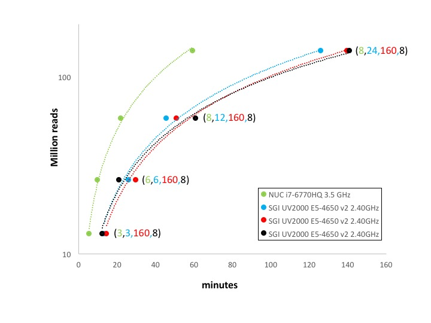

```


### chipseqCounts performances

We run respectively 37, 70, 111, and 149 million reads using different number of threads, values shown in parenthesis in figure below.

```{r fig.3, fig.cap="chipseqCounts overall performance", echo=FALSE, eval=TRUE, out.width="70%", fig.align="center"}
library(knitr)

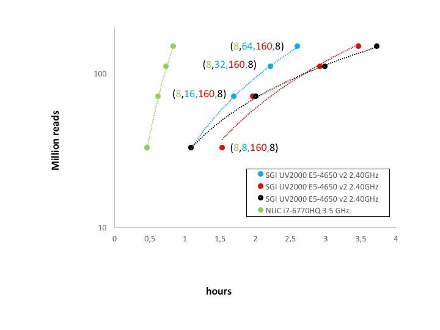

```


From the point of view of parallelization the **rnaseqCounts** is the one that embeds the most computing demanding tools: i) mapping with STAR and ii) quantifying transcripts with RSEM. Both these tools were design to take advantage of multiple cores hardware architecture and they also require massive I/O. On the basis of the results shown in *Figure 1* parallelization does not improve very much the overall performances, even if it can mitigate the gap w.r.t. SeqBox due to the poor I/O performance of the SATA disk array. On the other side the presence of a SSD with very high I/O performance can remedy the limited amount of cores of SeqBox.

In the case of **mirnaCounts** and **chipseqCounts** the parallelization is very little and it is only available for the reads mapping procedure. Moreover, both functions have a massive I/O. The reduced parallelization of these two analyses combined with the higher I/O throughput of the SSD with respect to the SATA array makes SeqBox extremely effective even with very high number of reads to be processed, *Figure 2  and 3*.

## Test sets

A folder including a set do dataset to test each of the workflows available in docker4seq/4SeqGUI can be found [**here**](http://130.192.119.59/public/test.zip)


## RNAseq workflow: Howto

### Demultiplexing

*demultiplexing* function is used to convert in fastq bcl files generated by an Illumina sequencer. The function requires that in the bcl folder the SampleSheet.csv is present. An example fo SampleSheet for a pair-end run is present in docker4seq examples folder. The function require that the full path to the bcl file folder is provided, **data.folder**, the scratch folder where temporary analysis is run and the number of cores that will be used by the program.

```{r,  echo=TRUE, eval=FALSE}
demultiplexing(group="docker",
      data.folder="/home/calogero/Documents/data/lollini/3a_run/170712_NB501050_0097_AH3FGNBGX3",
      scratch.folder="/data/scratch", threads=24)
```

The function will return, in the folder containing the bcl files folder, e.g. \/home\/calogero\/Documents\/data\/lollini\/3a_run\/, the fastq files generated by the analysis.

This function is not implemented in **4SeqGUI** because this step is generally done by a core lab. Thus only a limited group of users require the use of this function.

The **mRNAseq workflow**, that can be handled using **4SeqGUI** graphical interface (linux/MAC) (figure below), starts from the availability of fastq files .

```{r fig.4, fig.cap="mRNAseq workflow", echo=FALSE, eval=TRUE, out.width="100%", fig.align="center"}
library(knitr)

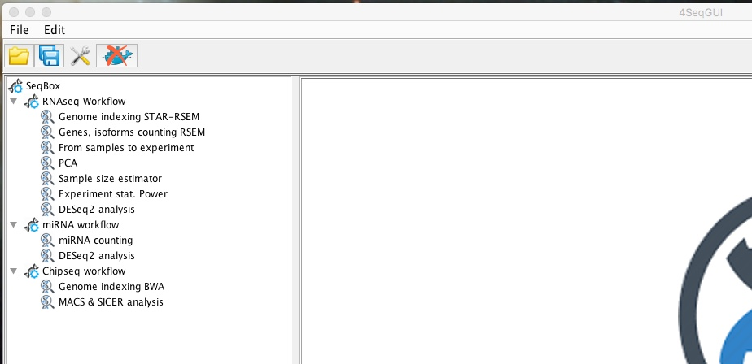

```


Sample quantification is made of these steps:

- Creating a genome index for STAR (see end of this paragraph)

- Running removing sequencing adapters

- Mapping reads to the reference genome

- Quantify gene and transcript expression level

- Annotating genes.

All the parameters can be setup using 4SeqGUI

### Creating a STAR index file for mRNAseq

The index can be easily created using the graphical interface:

```{r fig.5, fig.cap="Creating a STAR genome index", echo=FALSE, eval=TRUE, out.width="100%", fig.align="center"}
library(knitr)

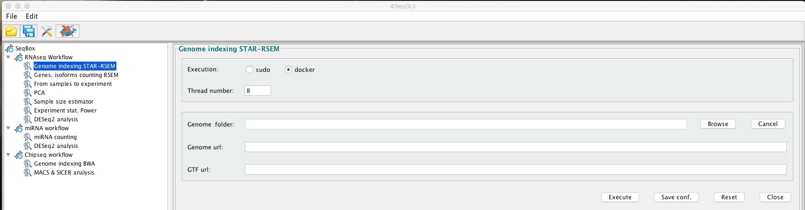

```


A detailed description of the parameters is given below.

#### Creating a STAR index file by line command

\fontsize{8}{8}\selectfont
```{r,  echo=TRUE, eval=FALSE}
rsemstarIndex(group="docker",genome.folder="/data/scratch/hg38star",
ensembl.urlgenome="ftp://ftp.ensembl.org/pub/release-87/fasta/homo_sapiens/dna/Homo_sapiens.GRCh38.dna.toplevel.fa.gz",
ensembl.urlgtf="ftp://ftp.ensembl.org/pub/release-87/gtf/homo_sapiens/Homo_sapiens.GRCh38.87.gtf.gz")
```

In brief, **rsemstarIndex** uses ENSEMBL genomic data. User has to provide the URL (**ensembl.urlgenome**) for the file XXXXX_dna.toplevel.fa.gz related to the organism of interest, the URL (**ensembl.urlgtf**) for the annotation GTF XXX.gtf.gz and the path to the folder where the index will be generated (**genome.folder**). The parameter **threads** indicate the number of cores dedicated to this task.

Precompiled index folders are available:

- [hg38star](http://130.192.119.59/public/hg38star.tar.gz)

- [mm10star](http://130.192.119.59/public/mm10star.tar.gz)


### Quantifying genes/isoforms


```{r fig.6, fig.cap="Gene, Isoform counting", echo=FALSE, eval=TRUE, out.width="100%", fig.align="center"}
library(knitr)

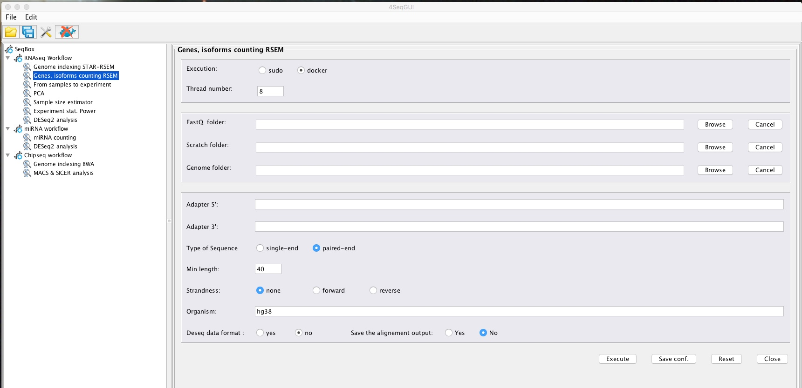

```


A detailed description of the parameters is given below.

#### Sample quantification by line command

The sample quantification can be also executed using R and it is completely embedded in a single function:

```{r, echo=TRUE, eval=FALSE}

#test example
system("wget http://130.192.119.59/public/test.mrnaCounts.zip")
unzip("test.mrnaCounts.zip")
setwd("./test.mrnaCounts")
library(docker4seq)
rnaseqCounts(group="docker",fastq.folder=getwd(), scratch.folder=getwd(),
adapter5="AGATCGGAAGAGCACACGTCTGAACTCCAGTCA",
adapter3="AGATCGGAAGAGCGTCGTGTAGGGAAAGAGTGT",
seq.type="se", threads=8,  min.length=40,
genome.folder="/data/scratch/mm10star", strandness="none", save.bam=FALSE,
org="mm10", annotation.type="gtfENSEMBL")

```


User needs to create the **fastq.folder**, where the fastq.gz file(s) for the sample under analysis are located.
The **scratch.folder** is the location where temporary data are created. The results will be then saved in the **fastq.folder**.

User needs to provide also the sequence of the sequencing adapters, **adapter5** and **adapter3** parameters. In case Illumina platform the adapters sequences can be easily recovered [**here**](https://support.illumina.com/downloads/illumina-customer-sequence-letter.html).

**seq.type** indicates if single-end (se) or pair-end (pe) data are provided, **threads** indicates the max number of cores used by *skewer* and *STAR*, all the other steps are done on a single core.

The **min.length** refers to the minimal length that a reads should have after adapters trimming. Since today the average read length for a RNAseq experiment is 50 or 75 nts would be better to bring to 40 nts the min.length parameter to increase the precision in assigning the correct position on the genome.

The **genome.folder** parameter refers to the location of the genomic index generated by STAR using the *docker4seq* function **rsemstarIndex**, see above paragraph.


**strandness**, is a parameter referring to the kit used for the library prep. If the kit does not provide strand information it is set to "none", if provides strand information is set to "forward" for  Illumina stranded kit and it set to "reverse" for Illumina ACCESS kit. **save.bam** set to TRUE indicates that genomic bam file and transcriotomic bam files are also saved at the end of the analysis. **annotation.type** refers to the type of available gene-level annotation. At the present time is only available ENSEMBL annotation defined by the gtf downloaded during the creation of the indexed genome files, see paragraph *at the end*Creating a STAR index file for mRNAseq*.


### Salmon, reference free alignment

Recently Zhang and coworkers (BMC Genomics 2017, 18,583) compared, at transcript level, alignment-dependent tools (Salmon_aln, eXpress, RSEM and TIGAR2) and aligner-free methods (Salmon, Kallisto Sailfish). In their paper, STAR was used as mapping tool for all alignment-dependent tools. In terms of isoform quantification, the authors indicated that there is strong concordance among quantification results from RSEM, Salmon, Salmon_aln, Kallisto and Sailfish (R2 > 0.89), suggesting that the impact of mappers on isoform quantification is small. Furthermore, the paper of Teng and coworkers (Genome Biology 2016, 17,74) reported that,in term of gene-level quantification, differences between alignment-dependent tools and aligner-free methods are shrinking with respect to transcripts level analysis.
On the basis of the above papers it seems that from the quantification point of view the difference between alignment free and alignment-dependent tools is very limited.
However, aligner-free methods have low memory requirements and we added Salmon in docker4seq.

#### Creating a Salmon quasi-reference file for mRNAseq

The quasi-reference can be created using cDNA fasta files available at ENSEMBL. The corresponding genomics GTF is required for the gene level annotation:


```{r fig.7, fig.cap="Salmon reference", echo=FALSE, eval=TRUE, out.width="100%", fig.align="center"}
library(knitr)

include_graphics('../inst/img/salmonIndex.jpeg')

```


```{r, echo=TRUE, eval=FALSE}

#running salmonIndex human
salmonIndex(group="docker", index.folder=getwd(),
       ensembl.urltranscriptome="ftp://ftp.ensembl.org/pub/release-90/fasta/homo_sapiens/cdna/Homo_sapiens.GRCh38.cdna.all.fa.gz",
       ensembl.urlgtf="ftp://ftp.ensembl.org/pub/release-90/gtf/homo_sapiens/Homo_sapiens.GRCh38.90.gtf.gz",
       k=31)

```


#### Quantifying isoforms and genes with Salmon

Salmon quantification function *wrapperSalmon* has the same structure of *rnaseqCounts*. It performs adapters trimming, transcripts quantification, genes quantification and annotation.  The output of wrapperSalmon is identical to the output of rnaseqCounts for what concern the files **isoforms.results** and **gtf_annotated_genes.results**, which can be used by *samples2experiment* to generate the tables for differential expression analysis:


```{r fig.8, fig.cap="Salmon quantification", echo=FALSE, eval=TRUE, out.width="100%", fig.align="center"}
library(knitr)

include_graphics('../inst/img/salmonCounts.jpeg')

```


```{r, echo=TRUE, eval=FALSE}

system("wget http://130.192.119.59/public/test_R1.fastq.gz")
system("wget http://130.192.119.59/public/test_R2.fastq.gz")

#running salmonCounts
wrapperSalmon(group="docker", scratch.folder="/data/scratch/",
         fastq.folder=getwd(), index.folder="/data/genome/salmonhg38/",
         threads=8, seq.type="pe", adapter5="AGATCGGAAGAGCACACGTCTGAACTCCAGTCA",
         adapter3="AGATCGGAAGAGCGTCGTGTAGGGAAAGAGTGT", min.length=40, strandness="none")

```


**IMPORTANT**: Salmon produces only isoforms-level counts, thus we quantified gene-level counts as described by RSEM:

- Gene counts are gived by the sum of the counts associated to all transcripts associated to the gene locus.

- Gene-length is given by the mean length of the transcripts having counts greater than 0 or by the mean of all the transcripts annotated in the gene locus in case all transcripts have counts equal to 0.

However, there are some differences between the information present in RSEM and Salmon annotation:

|                       |  RSEM  | SALMON |
|:---------------------:|:------:|:------:|
| Annotated transcripts | 197898 | 164819 |
|    Annotated genes    |  57955 |  34912 |
|        Biotypes       |   43   |   24   |

The biotypes lacking in Salmon are 20, because the pseudo-reference is build using ENSEMBL cDNA fasta file:

processed_transcript, antisense, lincRNA, sense_intronic, sense_overlapping, 3prime_overlapping_ncRNA, bidirectional_promoter_lncRNA, snRNA,
miRNA, misc_RNA, snoRNA, rRNA, ribozyme, TEC, scRNA, scaRNA, vaultRNA, sRNA, macro_lncRNA, non_coding.

Furthermore, the data generated by SALMON do not overlap perfectly to RSEM output:


```{r fig.9, fig.cap="RSEM versus SALMON", echo=FALSE, eval=TRUE, out.width="100%", fig.align="center"}
library(knitr)

include_graphics('../inst/img/salmon_rsem.jpg')

```

Panel A above indicates that although there is a limited correlation between SALMON and RSEM expected counts (black) at transcript-level, **R2=0.35**, some transcripts are detected with more counts by SALMON, see vertical spikes. SALMON TPMs are generally higher of those estimated in RSEM (Panel A, red). This behavior is still present at gene-level (Panel B) and the R2 for the expected counts is **0.56**. The correlation between SALMON and RSEM at counts level (transcripts/genes) is always better of that observed at FPKM or TPM level.
It is notable that length estimation between SALMON and RSEM is well correlated only for transcripts/genes bigger than 100 nts (Panels C, D).


### Sample quantification output files

The mRNAseq workflow produces the following output files:

    + XXXXX-trimmed.log, containing the information related to the adapters trimming
    + gtf_annotated_genes.results, the output of RSEM gene quantification with gene-level annotation
    + Log.final.out, the statistics of the genome mapping generated by STAR  
    + rsem.info, summary of the parameters used in the run
    + genes.results, the output of RSEM gene quantification
    + isoforms.results, the output of RSEM isoform quantification
    + run.info, some statistics on the run
    + skewerd_xxxxxxxxxxxx.log, log of the skewer docker container
    + stard.yyyyyyyyyyyy.log, log of the star docker container

```{r fig.10, fig.cap="gtf_annotated_genes.results", echo=FALSE, eval=TRUE, out.width="100%", fig.align="center"}
library(knitr)

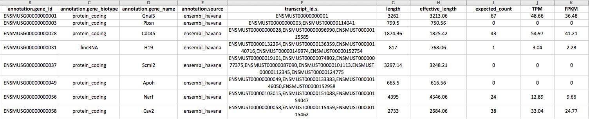

```


In the figure above, the first column in **gtf_annotated_genes.results** is the ensembl gene id, the second is the [biotype](http://www.ensembl.org/Help/Faq?id=468),
the 3rd is the annotation source, the 4th contains the set of transcripts included in the ensembl gene id. Then there is the length of the gene, the lenght of the gene to which is subtracted the average length of the sequenced fragments, the expected counts are the counts to be used for differential expression analysis. [TPM](https://haroldpimentel.wordpress.com/2014/05/08/what-the-fpkm-a-review-rna-seq-expression-units/) and [FPM](https://haroldpimentel.wordpress.com/2014/05/08/what-the-fpkm-a-review-rna-seq-expression-units/) are normalized gene quantities to be used only for visualization purposes.

### From samples to experiment

The RSEM output is sample specific, thus it is necessary to assemble the single sample in an experiment table including in the header of the column both the covariates and the batch, if any.
The header sample name is separated by the covariate with an underscore, e.g. mysample1\_Cov1, mysample2\_Cov2:

```{r fig.11, fig.cap="counts table with covariates", echo=FALSE, eval=TRUE, out.width="100%", fig.align="center"}
library(knitr)

include_graphics('../inst/img/counts1.jpeg')

```


In case also a batch is present also this is added to the sample name through a further underscore, e.g. mysample1\_Cov1\_batch1, mysample2\_Cov\_batch2:

```{r fig.12, fig.cap="counts table with covariates and batch", echo=FALSE, eval=TRUE, out.width="100%", fig.align="center"}
library(knitr)

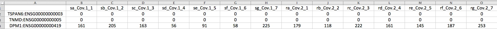

```


The addition of the covariates to the various samples can be done using the **4seqGUI** using the button: *From samples to experiment*:

```{r fig.13, fig.cap="generating a table with covariates", echo=FALSE, eval=TRUE, out.width="100%", fig.align="center"}
library(knitr)

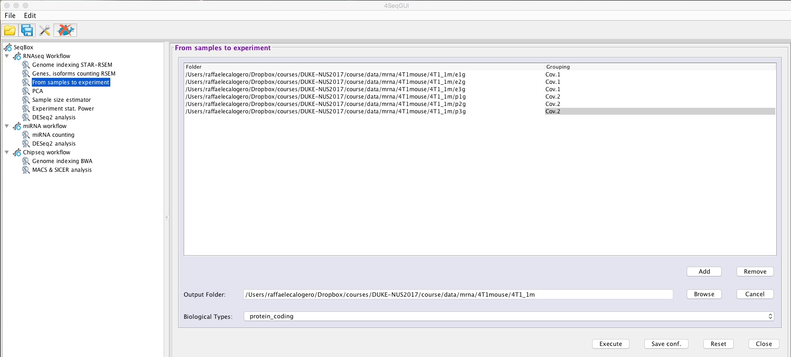

```


#### From samples to experiments by line command

```{r, echo=TRUE, eval=FALSE}
#test example
system("wget http://130.192.119.59/public/test.samples2experiment.zip")
unzip("test.samples2experiment.zip")
setwd("test.samples2experiment")
library(docker4seq)
sample2experiment(sample.folders=c("./e1g","./e2g","./e3g",
"./p1g", "./p2g", "./p3g"),
covariates=c("Cov.1","Cov.1","Cov.1","Cov.2","Cov.2","Cov.2"),
bio.type="protein_coding", output.prefix=".")

```

User needs to provide the paths of the samples, **sample.folder** parameter, a vector of the covariates, **covariates**, and the biotype(s) of interest, **bio.type** parameter. The parameter **output.prefix** refers to the path where the output will be created, as default this is the current R working folder.

#### From samples to experiments output files

The samples to experiments produces the following output files:

    + _counts.txt: gene-level raw counts table for differential expression analysis
    + _isoforms_counts.txt: isoform-level raw counts table for differential expression analysis
    + _isoforms_log2TPM.txt: isoform-level log2TPM for visualization purposes
    + _log2TPM.txt: gene-level log2TPM for visualization purposes
    + _isoforms_log2FPKM.txt: isoform-level log2FPKM for visualization purposes
    + _log2FPKM.txt: gene-level log2FPKM for visualization purposes
    + XXXXX.Rout: logs of the execution


### Visualizing experiment data with PCA

[PCA](https://georgemdallas.wordpress.com/2013/10/30/principal-component-analysis-4-dummies-eigenvectors-eigenvalues-and-dimension-reduction/) is a statistical procedure that uses an orthogonal transformation to convert a set of observations of possibly correlated variables into a set of values of linearly uncorrelated variables called principal components. This transformation is defined in such a way that the first principal component accounts for as much of the variability in the data as possible, and each succeeding component in turn has the highest variance possible under the constraint that it is orthogonal to the preceding components.
**4SeqGUI** provides an interface to the generation experiment samples PCA:

```{r fig.14, fig.cap="PCA", echo=FALSE, eval=TRUE, out.width="100%", fig.align="center"}
library(knitr)

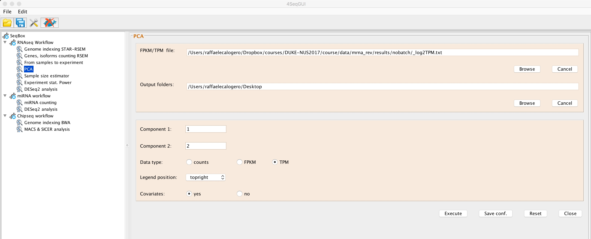

```


The plot is saved in **pca.pdf** in the selected folder.

#### PCA by line command

```{r, echo=TRUE, eval=FALSE}
#test example
system("wget 130.192.119.59/public/test.analysis.zip")
unzip("test.analysis.zip")
setwd("test.analysis")
library(docker4seq)
pca(experiment.table="_log2FPKM.txt", type="FPKM", legend.position="topleft", covariatesInNames=FALSE, principal.components=c(1,2), pdf = TRUE, output.folder=getwd())

```

User needs to provide the paths of experiment table, **experiment.table** parameter, i.e. the file generated using the samples2experiment function. The **type** parameter indicates if FPKM, TPM or counts are used for the PCA generation. The parameter **legend.position** defines where to locate the covariates legend. The parameter **covariatesInNames** indicates if the header of the experiment table contains or not covariate information. The parameter **principal.components** indicates which principal components should be plotted. **output.folder** indicates where to save the pca.pdf file:

```{r fig.15, fig.cap="pca.pdf", echo=FALSE, eval=TRUE, out.width="100%", fig.align="center"}
library(knitr)

include_graphics('../inst/img/pca2.jpeg')

```


The values in parentesis on x and y axes are the amount of variance explained by each principal component.

IMPORTANT: The above analysis is suitable also for miRNAseq data

### Evaluating sample size and experiment power

Sample size estimation is an important issue in the design of RNA sequencing experiments. Furthermore, experiment power provides an indication of which is the fraction of differentially expressed genes that can be detected given a specific number of samples and differential expression detection thresholds.
[RnaSeqSampleSize](https://www.ncbi.nlm.nih.gov/pubmed/25246651) Bioconductor package provides the possibility to calculate, from a pilot experiment, the statistical power and to define the optimal sample size.
We have implemented wrapper functions to  RnaSeqSampleSize sample size and experiment power estimation.


**4SeqGUI** provides an interface to sample size estimation:

```{r fig.16, fig.cap="sample size estimation", echo=FALSE, eval=TRUE, out.width="100%", fig.align="center"}
library(knitr)

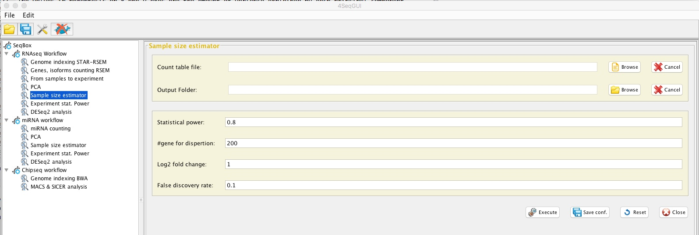

```

and to statistical power estimation:

```{r fig.17, fig.cap="experiment power estimation", echo=FALSE, eval=TRUE, out.width="100%", fig.align="center"}
library(knitr)

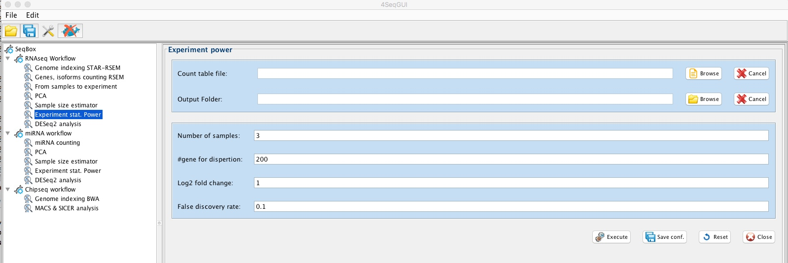

```


#### Sample size estimation by line command

```{r, echo=TRUE, eval=FALSE}
#test example
system("wget 130.192.119.59/public/test.analysis.zip")
unzip("test.analysis.zip")
setwd("test.analysis")
library(docker4seq)
sampleSize(group="docker", filename="_counts.txt", power=0.80, FDR=0.1, genes4dispersion=200, log2fold.change=1)

```

The requested parameters are the path to the counts experiment table generated by **samples2experiment** function. The param **power** indicates the expected fraction of differentially expressed gene, e.g 0.80. **FDR** and **log2fold.change**  are the two thresholds used to define the set of differentially expressed genes of interest.

The output file is **sample_size_evaluation.txt** is saved in the R working folder, below an example of the file content:

```{r fig.18, fig.cap="sample_size_evaluation.txt", echo=FALSE, eval=TRUE, out.width="100%", fig.align="center"}
library(knitr)

include_graphics('../inst/img/samplesize1.jpeg')

```

IMPORTANT: The above analysis is suitable also for miRNAseq data


#### Experiment statistical power estimation by line command

```{r, echo=TRUE, eval=FALSE}
#test example
system("wget 130.192.119.59/public/test.analysis.zip")
unzip("test.analysis.zip")
setwd("test.analysis")
library(docker4seq)
experimentPower(group="docker", filename="_counts.txt",replicatesXgroup=7, FDR=0.1, genes4dispersion=200, log2fold.change=1)

```


The requested parameters are the path to the counts experiment table generated by **samples2experiment** function. The param **replicatesXgroup** indicates the number of sample associated with each of the two covariates. **FDR** and **log2fold.change**  are the two thresholds used to define the set of differentially expressed genes of interest. **genes4dispersion** indicates the number of genes used in the estimation of read counts and dispersion distribution.

The output file is **power_estimation.txt** is saved in the R working folder, below an example of the file content:

```{r fig.19, fig.cap="power_estimation.txt", echo=FALSE, eval=TRUE, out.width="100%", fig.align="center"}
library(knitr)

include_graphics('../inst/img/expp1.jpeg')

```


IMPORTANT: The above analysis is suitable also for miRNAseq data

### Differential expression analysis with DESeq2

A basic task in the analysis of count data from RNA-seq is the detection of differentially expressed genes.
**4SeqGUI** provides an interface to DESeq2 to simplify differential expression analysis:

```{r fig.20, fig.cap="DESeq2", echo=FALSE, eval=TRUE, out.width="100%", fig.align="center"}
library(knitr)

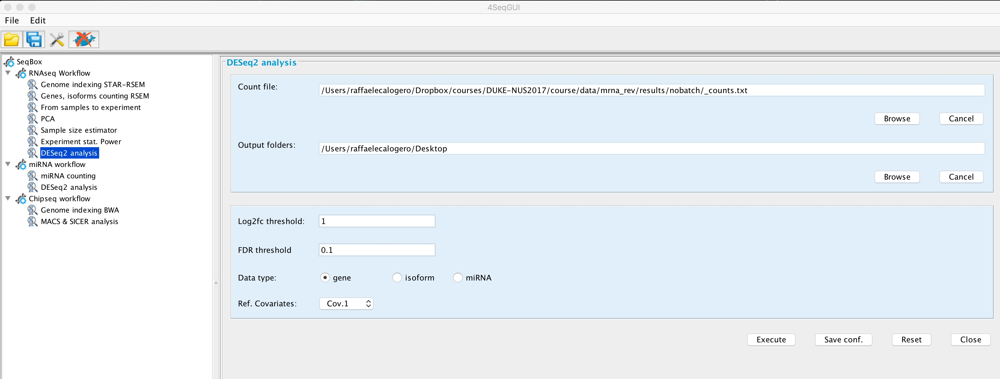

```

The output files are:

**DEfull.txt** containing the full set of results generated by DESeq2:

```{r fig.21, fig.cap="DEfull.txt", echo=FALSE, eval=TRUE, out.width="100%", fig.align="center"}
library(knitr)

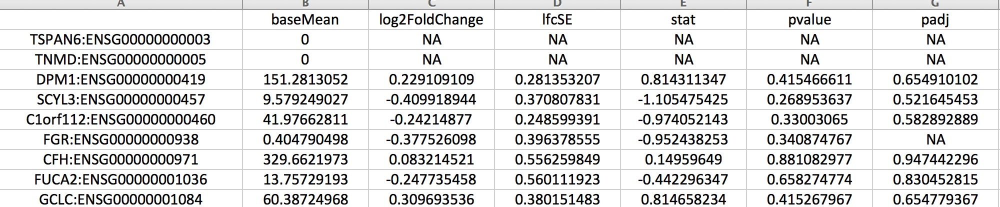

```

**DEfiltered_log2fc_X_fdr_Y.Y.txt** containing the set of differentially expressed genes passing the indicated thresholds:

```{r fig.22, fig.cap="DEfiltered_log2fc_1_fdr_0.1.txt", echo=FALSE, eval=TRUE, out.width="100%", fig.align="center"}
library(knitr)

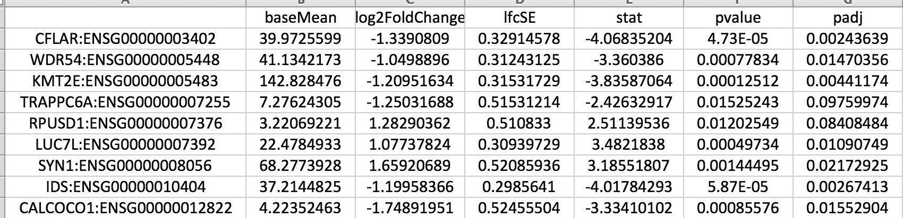

```

**genes2go.txt** a file containing only the gene symbols to be used as input for [DAVID](https://david.ncifcrf.gov/) or [ENRICHR](http://amp.pharm.mssm.edu/Enrichr/)

log2normalized_counts.txt, log2 library size normalized counts, calculated by DESeq2, that can be used for visualization purposes.

#### DESeq2 by line command

```{r, echo=TRUE, eval=FALSE}
#test example
system("wget 130.192.119.59/public/test.analysis.zip")
unzip("test.analysis.zip")
setwd("test.analysis")
library(docker4seq)
wrapperDeseq2(output.folder=getwd(), group="docker",
      experiment.table="_counts.txt", log2fc=1, fdr=0.1,
      ref.covar="Cov.1", type="gene", batch=FALSE)
```


User has to provide experiment table, **experiment.table** param, i.e. the counts table generated with **samples2experiment** function, the thresholds for the differential expression analysis, **log2fc** and **fdr** params, the reference covariate, **ref.covar** param, i.e. the covariate that is used as reference for differential expression detection, the **type** param, which refers to the type of experiment table in use: *gene*, *isoform*, *mirna*, **batch** parameter that indicates, if it is set to **TRUE** that the header of the experiment table also contains the extra information for the batch effect (see above).

IMPORTANT: the above analysis can be also applied to miRNAseq data.

### Subsetting counts/FPKM/TPM with differentially expressed genes

The function *filterCounts* allows to generate counts/FPKM/TPM tables that contains only differentially expressed genes. These tables can be used for visualization purposes, e.g. hetmaps generation with [**ClustVis**](https://biit.cs.ut.ee/clustvis/):

```{r fig.23, fig.cap="Count Filter", echo=FALSE, eval=TRUE, out.width="100%", fig.align="center"}
library(knitr)

include_graphics('../inst/img/filtercounts.jpeg')

```

#### filterCounts

```{r, echo=TRUE, eval=FALSE}
system("wget 130.192.119.59/public/test.analysis.zip")
unzip("test.analysis.zip")
setwd("test.analysis")
library(docker4seq)
     wrapperDeseq2(output.folder=getwd(), group="docker", experiment.table="_counts.txt", log2fc=1,
     fdr=0.1, ref.covar="Cov.1", type="gene", batch=FALSE))

    filterCounts(data.folder=getwd(), type="gene")

```

IMPORTANT: the above analysis can be also applied to miRNAseq data, using for the type parameter **mirna**. In this case also mean centered CPMs are calculated (**NOTE: DE filtered CPM are log2 transformed!**).

The outputs of **filterCounts** function start with **DEfiltered**.  Mean centered data indicates that for each gene count is divided by the mean of that gene over all samples. This representation is more convenient to observe changes between experimental groups.


### RNAseq workflow Tutorial

[**Tutorial experiment downloadable here**](http://130.192.119.59/public/test.mrnaCounts_full.zip):

    + Three replicates for two experimental conditions

    + single-end mode sequencing

    + 1 million reads for each sample

**Experiment description**:

    + 4T1 mouse cell line grown in standard DMEM medium (e) is compared with the same cells grown in low attachment medium (p)

The following data are available for download:

- [Fastq files for 3 samples grown in standard DMEM medium (e) and for 3 samples grown in low attachment medium (p) to be used to calculate samples counts](http://130.192.119.59/public/test.mrnaCounts_full.zip).

    + This data set allows running all the steps required to detect differentially expressed genes. The first step is the quantification of genes and isoforms via mapping reads to the reference genome via STAR and using this mapping information to quantify genes and transcripts using RSEM, i.e. *this section*.

    + The RSEM counts table, generated for all samples, are combined in a unique table, see *From samples to experiment* section. This table is used for differential expression genes detection. For visualization purposes  log2 FPKM and log2 TPM tables are also generated, see *From samples to experiment* section. More info on the FPKM and TPM are available [here](http://www.rna-seqblog.com/rpkm-fpkm-and-tpm-clearly-explained/).

    + Subsequently the overall characteristics of the dataset can be explore via [PCA](https://www.youtube.com/watch?v=BfTMmoDFXyE), *Visualizing experiment data with PCA* section.

    + It is also possible to evaluate which is the statistical power of the experiment, i.e. identifying the fraction of genes/transcripts that can be identify giving the statistical structure of the experiment, or identify the optimal number of samples required to detect differentially expressed genes. More info in *Evaluating sample size and experiment power* section.

    + Differential expression can be then evaluate using the DESeq2 module, *Differential expression analysis with DESeq2*.


- Furthermore, also intermediate results are provided:

    + [The counts tables generated by STAR+RSEM analysis to be used to assemble counts, TPM and FPKM experiment tables](http://130.192.119.59/public/test.samples2experiment.zip)

    + [The experiment tables that can be used to study samples organization via PCA or the statistical characteristics of the experiment, i.e. the statistical power and the optimal sample size of the experiment](http://130.192.119.59/public/test.analysis.zip)

    + The above data set can be used also to detect differentially expressed genes and isoforms using the DESeq2 module.


## miRNAseq workflow

The miRNAseq workflow can be run using **4SeqGUI** graphical interface:

```{r fig.24, fig.cap="miRNAseq workflow", echo=FALSE, eval=TRUE, out.width="100%", fig.align="center"}
library(knitr)

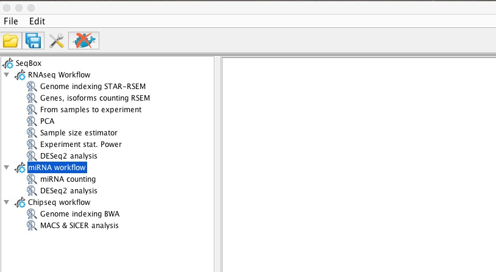

```

The miRNAseq docker container executes the following steps:

```{r fig.25, fig.cap="miRNAseq workflow", echo=FALSE, eval=TRUE, out.width="50%", fig.align="center"}
library(knitr)

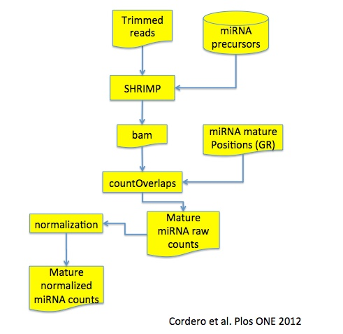

```

The full workflow is described in [Cordero et al. Plos ONE 2012](http://journals.plos.org/plosone/article?id=10.1371/journal.pone.0031630). In brief, fastq files are trimmed using [cutadapt](https://github.com/marcelm/cutadapt) and the trimmed reads are mapped on miRNA precursors, i.e. harpin.fa file, from [miRBase](http://www.mirbase.org/ftp.shtml) using [SHRIMP](http://compbio.cs.toronto.edu/shrimp/). Using the location of the mature miRNAs in the precursor, countOverlaps function, from the Bioconductor package GenomicRanges is used to quantify the reads mapping on mature miRNAs.


All the parameters needed to run the miRNAseq workflow can be setup using 4SeqGUI:

```{r fig.26, fig.cap="miRNAseq parameters", echo=FALSE, eval=TRUE, out.width="100%", fig.align="center"}
library(knitr)

include_graphics('../inst/img/mirna2.jpeg')

```

A detailed description of the parameters is given below.

### miRNAseq workflow by line command

The miRNAseq workflow can be also executed using R and it is completely embedded in a unique function:

```{r, echo=TRUE, eval=FALSE}
#test example
system("wget 130.192.119.59/public/test.mirnaCounts.zip")
unzip("test.mirnaCounts.zip")
setwd("test.mirnaCounts")
library(docker4seq)
mirnaCounts(group="docker",fastq.folder=getwd(), scratch.folder="/data/scratch",
            mirbase.id="hsa",download.status=FALSE, adapter.type="NEB", trimmed.fastq=FALSE)

```

User has to create the **fastq.folder**, where the fastq.gz files for all miRNAs under analysis are located.
The **scratch.folder** is the location where temporary data are created. The results will be then saved in the **fastq.folder**.
User has to provide also the identifier of the miRBase organism, e.g. **hsa** for Homo sapiens, **mmu** for Mus musculus.  If the **download.status** is set to FALSE, mirnaCounts uses miRBase release 21, if it is set to TRUE the lastest version of precursor and mature miRNAs will be downloaded from miRBase. Users need to provide the name of the producer of the miRNA library prep kit to identify which adapters need to be provided to cutadapt, **adapter.type** parameter. The available adapters are NEB and Illumina, but, upon request, we can add other adapters. Finally, if the **trimmed.fastq** is set to FALSE the trimmed fastq are not saved at the end of the analysis.


### miRNAseq workflow output files

The miRNAseq workflow produces the following output files:

    + README: A file describing the content of the data folder
    + all.counts.txt: miRNAs raw counts, to be used for differential expression analysis
    + trimmimg.log: adapters trimming statistics
    + shrimp.log: mapping statistics
    + all.counts.Rda: miRNAs raw counts ready to be loaded in R.
    + analysis.log: logs of the full analysis pipeline


### Adding covariates and batches to mirnaCounts output: all.counts.txt

**4SeqGUI** provides an interface to add covariates and batches to all.counts.txt:

```{r fig.27, fig.cap="miRNAseq covariates and batches", echo=FALSE, eval=TRUE, out.width="100%", fig.align="center"}
library(knitr)

include_graphics('../inst/img/mirna_covars.jpeg')

```

The function **mirnaCovar** add to the header of all.counts.txt covariates and batches or covariates only.

```{r, echo=TRUE, eval=FALSE}
#test example
system("wget 130.192.119.59/public/test.mirna.analysis.zip")
unzip("test.mirna.analysis.zip")
setwd("test.mirna.analysis")
library(docker4seq)
mirnaCovar(experiment.folder=paste(getwd(), "all.counts.txt", sep="/"),
     covariates=c("Cov.1", "Cov.1", "Cov.1", "Cov.1", "Cov.1", "Cov.1",
                  "Cov.2", "Cov.2", "Cov.2", "Cov.2", "Cov.2", "Cov.2"),
     batches=c("bath.1", "bath.1", "bath.2", "bath.2", "batch.1", "batch.1",
               "batch.2", "batch.2","batch.1", "batch.1","bath.2", "bath.2"), output.folder=getwd())
```


The output of **mirnaCovar**, i.e. w\_covar\_batch\_all.counts.txt, is compliant with PCA, Sample size estimator, Experiment stat. power and DEseq2 analysis.

### miRNAseq workflow Tutorial

[**Tutorial experiment downloadable here**](http://130.192.119.59/public/test.mirnaCounts.zip):

- Six specimens for two experimental conditions

- single-end mode sequencing,

- 1 million reads for each sample.

**Experiment description**:

- Six blood circulating exosomes miRNA samples from healthy donors (hd) and six blood circulating exosomes miRNA samples from tumor patients (tum)

- from 1 to 3 hd and tum samples were harvested on day 1, from 5 to 6 hd and tum samples were harvested on day 2. Thus the data are require the addition of the batch effect in differential expression analysis.

The following data are available for download:

- [Fastq files for 6 miRNA samples from healthy donors (hd), and six miRNA samples from tumor patients (tum) to be used to calculate samples counts and organize them in a counts table](http://130.192.119.59/public/test.mrnaCounts_full.zip).

    + This data set allows running all the steps required to detect differentially expressed genes. The first step is the quantification of mature annotated miRNA and the generation of counts table to be used for differential expression, i.e. *this section*.

    + The covariates and batch effects can be added to the counts table (all.counts.txt), see *From samples to experiment* section. This table is used for differential expression genes detection.  

    + Subsequently the overall characteristics of the dataset can be explore via [PCA](https://www.youtube.com/watch?v=BfTMmoDFXyE), *Visualizing experiment data with PCA* section.

    + It is also possible to evaluate which is the statistical power of the experiment, i.e. identifying the fraction of genes/transcripts that can be identify giving the statistical structure of the experiment, or identify the optimal number of samples required to detect differentially expressed genes. More info in *Evaluating sample size and experiment power* section.

    + Differential expression can be then evaluate using the DESeq2 module, *Differential expression analysis with DESeq2*.


## chipseq workflow

The chipseq workflow can be run using **4SeqGUI** graphical interface:

```{r fig.28, fig.cap="ChIPseq workflow", echo=FALSE, eval=TRUE, out.width="100%", fig.align="center"}
library(knitr)

include_graphics('../inst/img/chipseq0.jpeg')

```

The ChIPseq is made of two main steps:

- Creating a genome index for BWA (see end of this paragraph)

- Running MACS or SICER analysis

### Creating a BWA index file for Chipseq


The index can be easily created using the graphical interface:

```{r fig.29, fig.cap="Creating a BWA index with Genome indexing BWA", echo=FALSE, eval=TRUE, out.width="100%", fig.align="center"}
library(knitr)

include_graphics('../inst/img/chipseq1.jpeg')

```


```{r,  echo=TRUE, eval=FALSE}
bwaIndexUcsc(group="sudo",genome.folder="/sto2/data/scratch/mm10bwa", uscs.urlgenome=
"http://hgdownload.cse.ucsc.edu/goldenPath/mm10/bigZips/chromFa.tar.gz",
gatk=FALSE)
```

In brief, **bwaIndexUcsc** uses UCSC genomic data. User has to provide the URL (**uscs.urlgenome**) for the file chromFa.tar.gz related to the organism of interest and the path to the folder where the index will be generated (**genome.folder**). The parameter **gatk** has to be set to FALSE, it is not required for ChIPseq genomic index creation.

Precompiled index folders are available:

- [mm10bwa](http://130.192.119.59/public/mm10bwa.tar.gz)


### Calling peaks and annotating

All the parameters needed to run MACS or SICER can be setup using 4SeqGUI:

```{r fig.30, fig.cap="MACS and SICER analysis", echo=FALSE, eval=TRUE, out.width="100%", fig.align="center"}
library(knitr)

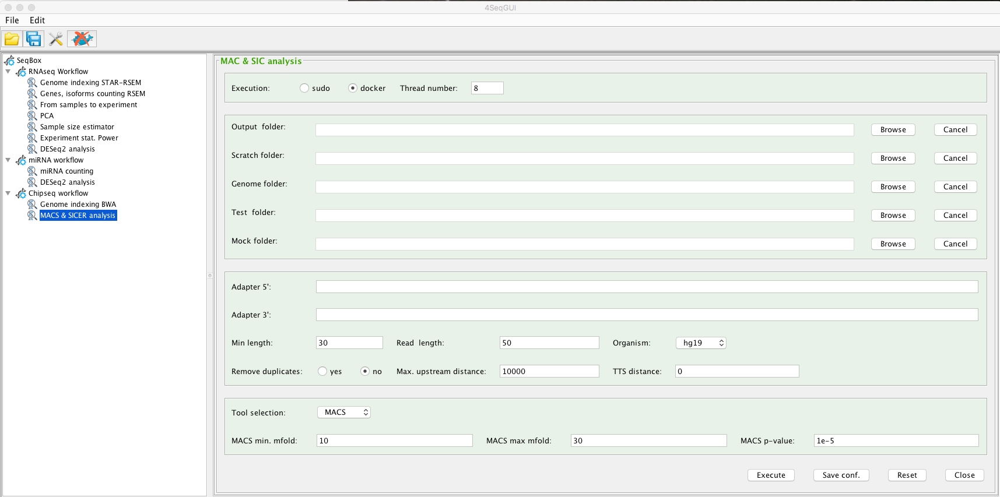

```

A detailed description of the parameters is given below.

### Chipseq workflow by line command

The chipseq workflow can be also executed using R and it is completely embedded in a unique function:

```{r, echo=TRUE, eval=FALSE}

system("wget 130.192.119.59/public/test.chipseqCounts.zip")
unzip("test.chipseqCounts.zip")
setwd("test.chipseqCounts")
library(docker4seq)
chipseqCounts(group = "docker", output.folder = "./prdm51.igg",
  mock.folder="./igg", test.folder="./prdm51", scratch.folder=getwd(),
  adapter5 = "AGATCGGAAGAGCACACGTCTGAACTCCAGTCA",
  adapter3 = "AGATCGGAAGAGCGTCGTGTAGGGAAAGAGTGT",
  threads = 8, min.length = 30, genome.folder,
  mock.id = "igg", test.id = "tf", genome, read.size = 50,
  tool = "macs", macs.min.mfold = 10, macs.max.mfold = 30,
  macs.pval = "1e-5", sicer.wsize = 200, sicer.gsize = 200,
  sicer.fdr = 0.1, tss.distance = 0, max.upstream.distance = 10000,
  remove.duplicates = "N")
```

Specifically user needs to create three folders:

    + mock.folder, where the fastq.gz file for the control sample is located. For control sample we refer to ChIP with IgG only or input DNA.
    + test.folder, where the fastq.gz file for the ChIP of the sample to be analysed.
    + output.folder, where the R script embedding the above script is located.

The **scratch.folder** can be the same as the **output.folder**. However, if the system has a high speed disk for temporary calculation, e.g. a SSD disk, the location of the scratch.folder on the SSD will reduce significantly the computing time.

User needs to provide also the sequence of the sequencing adapters, **adapter5** and **adapter3** parameters. In case Illumina platform  the adapters sequences can be easily recovered [here](https://support.illumina.com/content/dam/illumina-support/documents/documentation/chemistry_documentation/experiment-design/illumina-adapter-sequences_1000000002694-01.pdf).

**Threads** indicates the max number of cores used by *skewer* and *bwa*, all the other steps are done on a single core.
The **min.length** refers to the minimal length that a reads should have after adapters trimming. Since today the average read length for a ChIP experiment is 50 or 75 nts would be better to bring to 40 nts the min.length parameter to increase the precision in assigning the correct position on the genome.

The **genome.folder** parameter refers to the location of the genomic index generated by bwa using the *docker4seq* function **bwaIndexUcsc**.

**mock.id** and **test.id** identify the type of sample and are assigned to the ID parameter in the RG field of the bam file.

**genome** is the parameter referring to the annotation used to associate ChIP peaks with genes. In the present implementation  hg38, hg19 for human and mm10 and mm9 for mouse annotations are available.

**read.size** is a parameter requested by MACS and SICER for their analysis.
**macs.min.mfold**, **macs.max.mfold**, **macs.pval**  are the default parameters requested for  peaks definition for more info please refer to the documentation of MACS 1.4.
**sicer.wsize**, **sicer.gsize**, **sicer.fdr** are the default parameters requested for  peaks definition for more info please refer to the documentation of SICER 1.1.
**IMPORTANT**: The optimal value for **sicer.gsize** in case of H3K4Me3 ChIP is 200 and in case of ChIP H3K27Me3 is 600.   

**tss.distance** and **max.upstream.distance** are parameters required by ChIPseqAnno, which is the Bioconductor package used to assign the peaks to specific genes. Specifically max.upstream.distance refers to the max distance in nts that allows the association of a peak to a specific gene.

**remove.duplicates** is the parameter that indicates if duplicates have to be removed or not. It has two options: **N** duplicates are not removed, **Y** duplicates are removed.


### Chipseq workflow output files

The chipseq workflow produces the following output files:

    + README: A file describing the content of the data folder
    + mypeaks.xls: All detected peaks alongside the nearest gene and its annotation
    + mytreat.counts: The total reads count for the provided treatment file
    + mycontrol.counts: The total reads count for the provided control/background file
    + peak_report.xls: Aggregate information regarding the peak and their position relative to the nearest gene
    + chromosome_distribution.pdf: Barplot of the distribution of the peaks on the chromosomes
    + relative_position_distribution.pdf: Barplot of the distribution of the peaks positions relative to their nearest gene
    + peak_width_distribution.pdf: Histogram of the distribution of the width of the peaks
    + distance_from_nearest_gene_distribution.pdf: Histogram of the distribution of the distance of each peak from its nearest gene
    + cumulative_coverage_total.pdf: Cumulative normalized gene coverage
    + cumulative_coverage_chrN.pdf: Cumulative normalized gene coverage for the specific chromosome
    + mycontrol_sorted.bw: bigWig file for UCSC Genome Browser visualization
    + mytreat_sorted.bw: bigWig file for UCSC Genome Browser visualization

### ChIPseq workflow tutorial

[**Tutorial experiment downloadable here**](http://130.192.119.59/public/test.chipseqCounts.zip):

    + Two ChIPseq one IgG control and an other Prdm5 TF moAb (mouse)

    + single-end mode sequencing,

    + 1 million reads for each sample.

**Experiment description**:

- PRDM family members are transcriptional regulators involved in tissue specific differentiation. PRDM5 has been reported to predominantly repress transcription, but a characterization of its molecular functions in a relevant biological context is lacking. Prdm5 controls both Collagen I transcription and fibrillogenesis by binding inside the Col1a1 gene body and maintaining RNA polymerase II occupancy (Galli et al. PLoS Genet. 2012,e1002711).

- The toy experiment is organized in three folders: i. one for IgG (igg, containing the igg pool down fastq); ii. one for Prdm5 (prdm5, containing the Prdm5 pool down fastq) and iii. the other for analysis output prdm5.igg, where MACS results will be located. The execution of the ChIPseq workflow using GUI or line command will provide the final annotated table of peaks (mypeaks.xls)


## PDX Exomeseq workflow

Patient derived tumor xenografts (PDTX) are created when cancerous tissue from a patient's primary tumor is implanted directly into an immunodeficient mouse. PDTX models are providing solutions to the challenges that researchers face in cancer drug research such as positive tumor responses in mouse models but not translating over when the study is implemented in humans. As a result, PDTX cancer models are popular models to use in cancer drug research.
Exome sequencing is an importnat step of the PCX characterization. IN PDX we have the human tumor mixex with the mouse stroma and it is necessary to remove the mouse information from the exome data.
One way of removing the mouse component is the use of [xenome](https://academic.oup.com/bioinformatics/article-lookup/doi/10.1093/bioinformatics/bts236), which performs fast, accurate and specific classification of xenograft-derived sequence read data [gossamer](https://github.com/data61/gossamer/blob/master/docs/xenome.md).

### Creating Xenome index files


The index can be easily created using the the following function:


```{r,  echo=TRUE, eval=FALSE}
xenomeIndex(group="docker",xenome.folder="/data/scratch/hg19.mm10",
    hg.urlgenome="http://hgdownload.soe.ucsc.edu/goldenPath/hg19/bigZips/chromFa.tar.gz",
    mm.urlgenome="http://hgdownload.cse.ucsc.edu/goldenPath/mm10/bigZips/chromFa.tar.gz", threads=8)
```

In brief, **xenomeIndex** uses UCSC genomic data. User has to provide the **hg.urlgenome** for the human chromFa.tar.gz, the **mm.urlgenome** for the mouse chromFa.tar.gz and the path to the folder where the index will be generated (**xenome.folder**). The parameter **threads** indicates how many threads the user would like to use.


### Running Xenome

Xenome classification can be run using the following code:

```{r,  echo=TRUE, eval=FALSE}
system("wget http://130.192.119.59/public/mcf7_mouse_1m_R1.fastq.gz")
system("wget http://130.192.119.59/public/mcf7_mouse_1m_R2.fastq.gz")
#running xenome
xenome(group="docker",fastq.folder=getwd(), scratch.folder="/data/scratch",
         xenome.folder="/data/scratch/hg19.mm10", seq.type="pe",
         threads=8)
```

In brief, **xenome.folder** is the location of the output generated by **xenomeIndex**. The **scratch.folder** is the folder where temporary data are created. **seq.type** indicates if it is a pair-end **pe** or a single-end **se** sequence. The parameter **threads** indicates how many threads the user would like to use. **fastq.folder** is the folder were input fastq are located and where the output of xenome will be located.

## PDX data preprocessing HowTo

PDX data preprocessing is done stating from the fastq.gz file of a sample present in a user defined folder **fastq.folder**. Data preprocessing is done by **wrapperPdx** with embeds:

- **xenome** for mouse stromal data removal,

- **skewer** for adapter trimming,

- **bwa** for mapping and duplicates marking.

**IMPORTANT** In case the mutect v1 will be used it is necessary to use, a genome reference for **bwa** the following archive (61 GB):

```{r, echo=TRUE, eval=FALSE}
system("wget http://130.192.119.59/public/hg19_exome.tar.gz)
```

### wrapperPdx

PDX fastq preprocessing can be done with **wrapperPdx**.
These are the parameters to be passed:

```{r, echo=TRUE, eval=FALSE}
#example set made of 1 million reads of MCF7 exome data and 1 million reads of mouse genomic DNA pulled down with Illumina Nextera Rapid Capture Exome kit.

system("wget http://130.192.119.59/public/mcf7_mouse_1m_R1.fastq.gz")
system("wget http://130.192.119.59/public/mcf7_mouse_1m_R2.fastq.gz")

#running wrapperPdx
wrapperPdx(group="docker",fastq.folder=getwd(), scratch.folder="/data/scratch",
     xenome.folder="/data/scratch/hg19.mm10", seq.type="pe", threads=24,
     adapter5="AGATCGGAAGAGCACACGTCTGAACTCCAGTCA",
     adapter3="AGATCGGAAGAGCGTCGTGTAGGGAAAGAGTGT"
     min.length=40, genome.folder="/data/scratch/hg19_exome", sample.id="sampleX")
```

In brief, **xenome.folder** is the location of the output generated by **xenomeIndex**. The **scratch.folder** is the folder where temporary data are created. **seq.type** indicates if it is a pair-end **pe** or a single-end **se** sequence. The parameter **threads** indicates how many threads the user would like to use. **fastq.folder** is the folder were input fastq are located and where the output of xenome will be located.
User needs to provide also the sequence of the sequencing adapters, **adapter5** and **adapter3** parameters. In case Illumina platform the adapters sequences can be easily recovered [**here**](https://support.illumina.com/content/dam/illumina-support/documents/documentation/chemistry_documentation/experiment-design/illumina-adapter-sequences_1000000002694-01.pdf).
The **min.length** refers to the minimal length that a reads should have after adapters trimming. Since today the average read length for a RNAseq experiment is 50 or 75 nts would be better to bring to 40 nts the min.length parameter to increase the precision in assigning the correct position on the genome.
The **genome.folder** parameter refers to the location of the genomic index [**hg19_exome**](http://130.192.119.59/public/hg19_exome.tar.gz) required for **bwa**, see above.
**Sample.id** is a character string indicating the unique id to be associated to the bam that will be created.

### wrapperPdx output

The output of the function are three files:

- **xenome_folder**, which contains xeno_ambiguous_ (difficult to be classified as human or mouse),  xeno_both_ (classified in both mouse and human), xeno_mm_ (mouse specific reads), xeno_neither_ (not human or mouse, possibly adapter sequences) files.

- **xeno_hs_R1.fastq.gz**, xeno_hs_R2.fastq.gz, hg19 human associated reads, produced by xenome analysis and further processed by **wrapperPdx** to generated bam, bai and stats files.

- One or two gzip fastq files ending with **trimmed-pair1.fastq.gz** and **trimmed-pair1.fastq.gz**, a log file of the trimming with the extensione **trimmed.log**

- **dedup_reads.bam**, which is sorted and duplicates marked bam file generated by **bwa**,

- **dedup_reads.bai**, which is the index of the dedup_reads.bam generated by **bwa**,

- **dedup_reads.stats**, which provides mapping statistics generated by **bwa**.

### oncoSNP

The output of [oncoSNP](https://sites.google.com/site/oncosnp/) is used to associate to gene symbols the detected CN, rank 5 ([see oncoSNP help](https://sites.google.com/site/oncosnp/user-guide/interpreting-oncosnp-output)). This association is done using the *oncosnpAnnotation* function. The function requirements are the folder where the ouptut of oncoSNP is saved, i.e. where the file with extension .cnvs are located, and the folder where the ENSEMBL genome.gtf is located. The analysis returns for each .cnvs a file annotation_XXXXXX.cnvs.txt, which contains the genes location, gene symbol and CN and LOH ([see oncoSNP help](https://sites.google.com/site/oncosnp/user-guide/interpreting-oncosnp-output)). Please note

```{r, echo=TRUE, eval=FALSE}
system("wget http://130.192.119.59/public/test_oncosnp.zip")
system("unzip test_oncosnp.zip")

oncosnpAnnotation(group="docker", data.folder="./test_oncosnp/oncosnp_out", genome.folder="./test_oncosnp/hg19")
```
